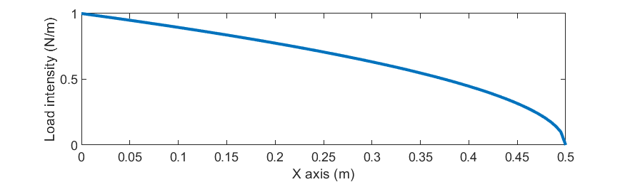

# Linear Beam
 Linear beam with dynamic loads and actuators
 The main functions are:
 `main_with_actuator.m` for DI controller. `main_integral_control.m` for robust-ODI.

The external load is given by the following image

